# Student Hostel Management System using Servlet and MySQL
   * A web-based hostel management system using **Java Servlets** and **MySQl**
     for backend processing.
   
# Features:
   - Student registration and login 
   - Room allocation and vacancy tracking
   - Fee Management
# Technologies used:
   - Java (Servlets, JSP)
   - MySQL
   - Tomcat Server
# Installation and Usage:
   * Clone the repository:
     git clone 
     https://github.com/subash19197/Student_Hostel_Management_System-JavaServlet
   * Set up MySQL with provided schema
   * Deploy the project on Apache Tomcat 9.0.89
# Screenshots:
 **1. Login:** 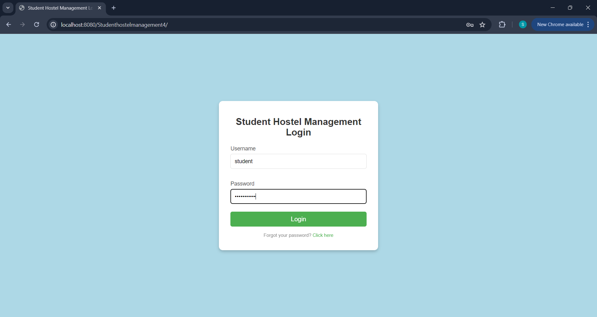
  
 **2. Management System:**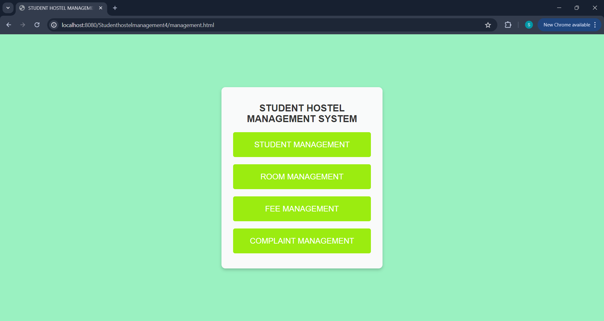
  
**3. Student Management:**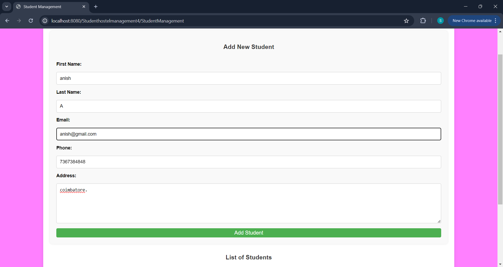
                       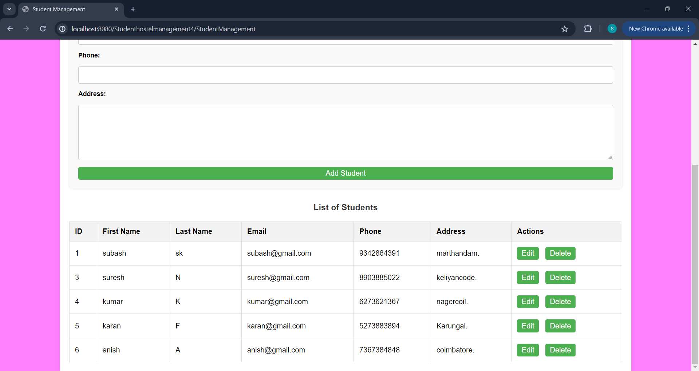
                       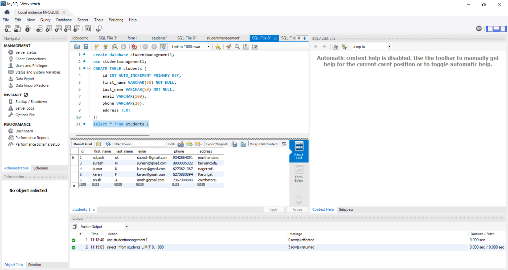
                       
**4. Room Management:**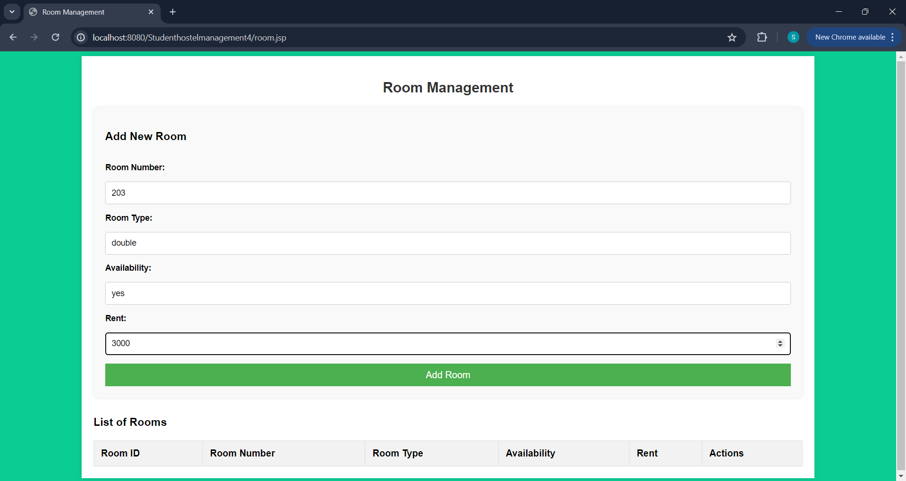
                       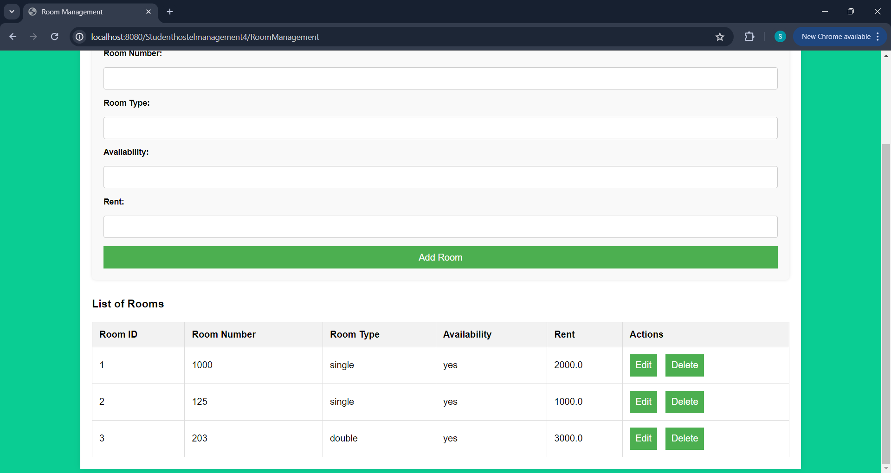
                       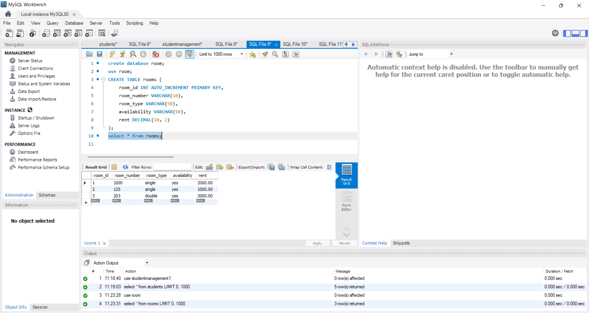
                       
**5. Fee Management:**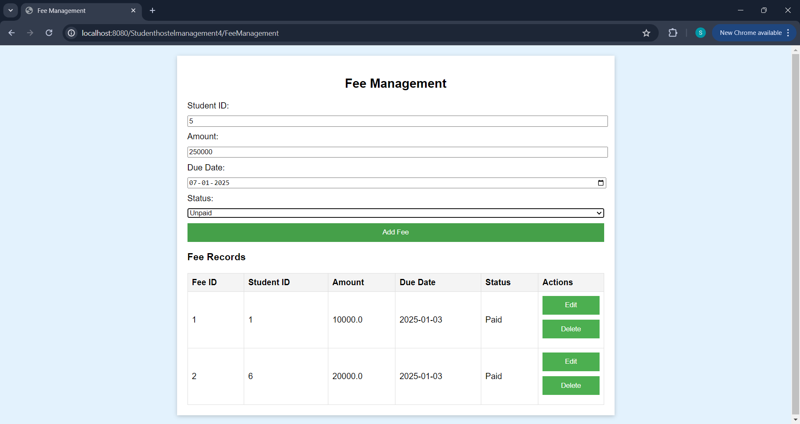
                       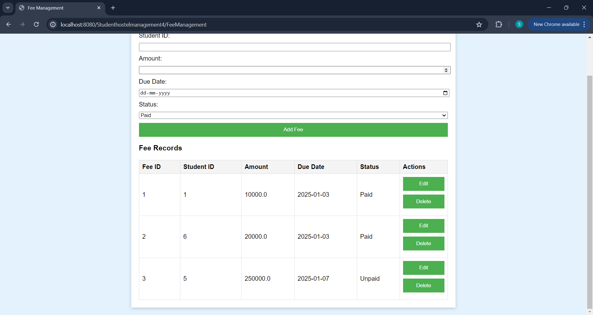
                       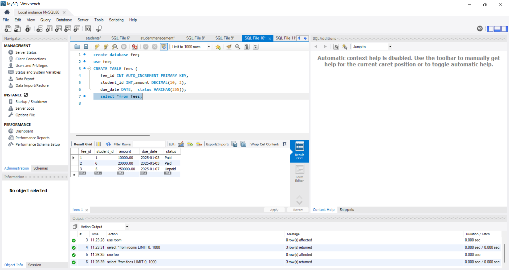
                       
**6. Complaint Management:**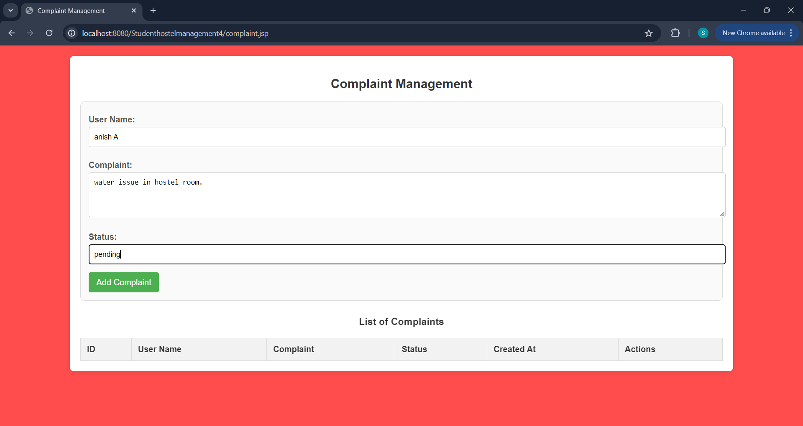
                       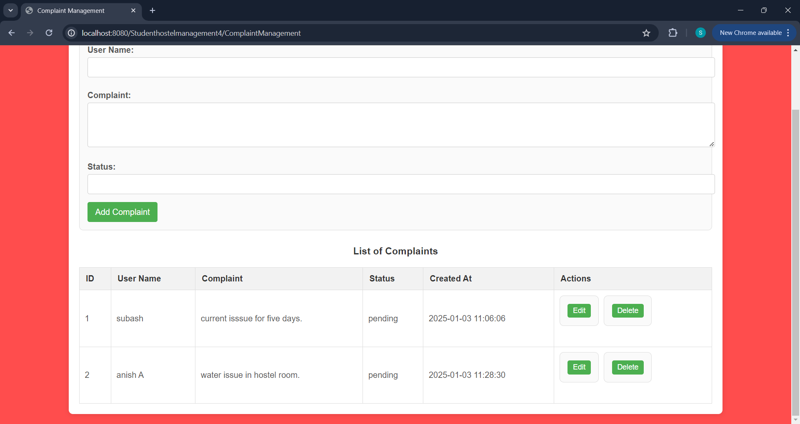
                       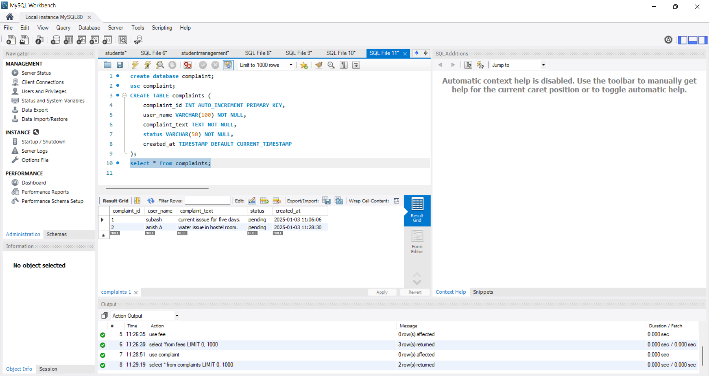

# Future Enhancements:
   - Add role-based admin/student
   - Implement automated notifications
# Author
    Subash.S.K
